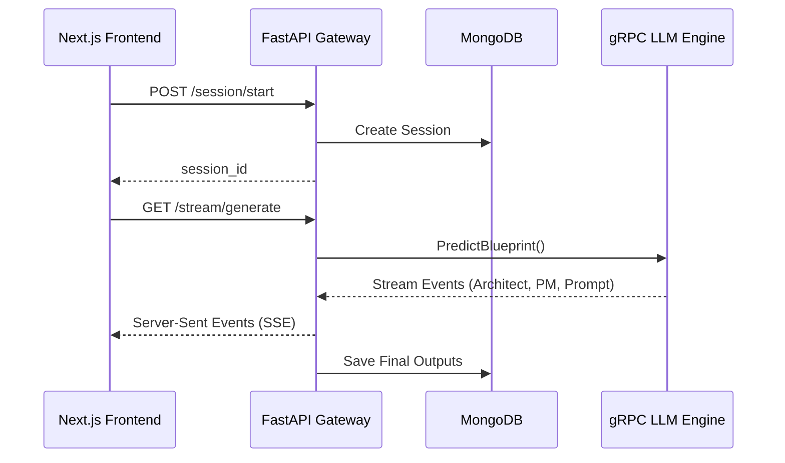

<div align="center">
  
  
  
  <h1>DevKit.AI — API Gateway</h1>
  <p>The high-performance central router and state manager for DevKit.AI.</p>
</div>

---

## Overview
This repository serves as the **API Gateway and Backend** for DevKit.AI. Built with FastAPI, it acts as the vital bridge between the interactive Next.js frontend and the heavy-duty LLM Engine gRPC microservice.

## System Architecture



## Core Features
- **Real-Time Blueprint Streaming**: Exposes `/stream/generate` endpoints that stream real-time Server-Sent Events (SSE) from the AI swarm back to the frontend.
- **Stateful Session Management**: Uses `motor` (AsyncIOMotorClient) to track user interviews across 6 distinct phases.
- **Natural Language Refinement**: Handles conversational modifications to existing blueprints and strategically patches the JSON document.
- **Artifact Exporting**: Instantly compiles the generated JSON blueprints into downloadable Markdown assets (VC Pitch Decks, Implementation Instructions).

## Local Development

```bash
# 1. Install dependencies
pip install -r requirements.txt

# 2. Set your environment variables
export MONGODB_URI="mongodb+srv://..."

# 3. Launch the API Gateway
uvicorn main:app --reload --port 8000
```
