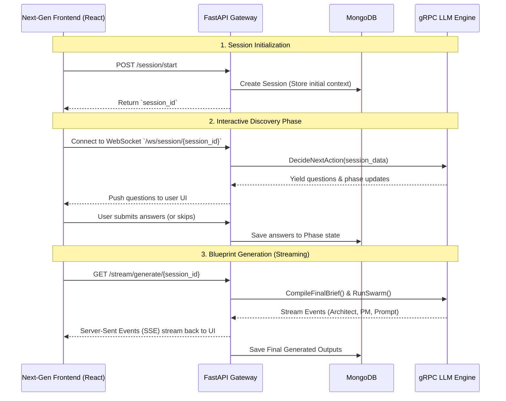

<div align="center">
  
  
  
  <h1>DevKit.AI — API Gateway & Backend</h1>
  <p>The high-performance central router and state manager for DevKit.AI.</p>
</div>

---

## 📌 Overview
This repository serves as the **API Gateway and Backend** for DevKit.AI. Built with FastAPI, it acts as the vital bridge between the interactive React frontend and the heavy-duty LLM Engine gRPC microservice.

It is responsible for maintaining stateful conversational context, proxying WebSocket connections for the AI Discovery Engine, and providing low-latency Server-Sent Events (SSE) streaming.

## 🏗️ System Architecture & Data Flow



## ✨ Core Features
- **Real-Time Blueprint Streaming**: Exposes `/stream/generate` endpoints that stream real-time Server-Sent Events (SSE) from the AI swarm back to the frontend.
- **Stateful Session Management**: Uses `motor` (AsyncIOMotorClient) to track user interviews across 6 distinct phases (UI/UX, Core Logic, Architecture, Security, Testing, Deployment).
- **Natural Language Refinement**: Handles conversational modifications to existing blueprints and strategically patches the JSON document without requiring a full LLM re-run.
- **Artifact Exporting**: Instantly compiles the generated JSON blueprints into downloadable Markdown assets (VC Pitch Decks, Implementation Instructions) and automated ZIP Boilerplates.

## 🚀 Quick Start & Local Development

### 1. Prerequisites
- Python 3.10+
- A running MongoDB instance (Local or Atlas)

### 2. Installation
Navigate into the `Backend` directory and install the required dependencies:
```bash
cd Backend
python -m venv .venv
source .venv/bin/activate  # On Windows use: .venv\Scripts\activate
pip install -r requirements.txt
```

### 3. Environment Configuration
You need to provide a MongoDB connection string.
```bash
# Set your environment variable for the database connection
export MONGODB_URI="mongodb://localhost:27017" # Or your MongoDB Atlas URI
```

### 4. Running the Server
Launch the FastAPI application using Uvicorn:
```bash
uvicorn main:app --reload --port 8000
```
*The API Gateway will now be accessible at `http://localhost:8000`. You can view the automatic Swagger documentation at `http://localhost:8000/docs`.*

---

## 📁 Directory Structure
- `/api/routes.py` — Core endpoint definitions (REST, WebSockets, SSE streams).
- `/core/session_manager.py` — MongoDB CRUD operations and session state handlers.
- `/core/grpc_clients.py` — The client stubs that communicate with the LLM gRPC Engine.
- `/routes/` — Modular endpoint logic for exporting pitch decks and boilerplate ZIP files.
